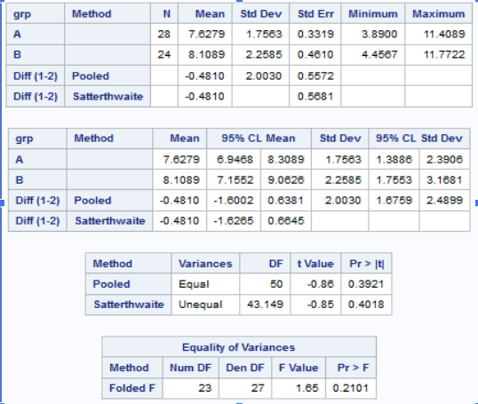
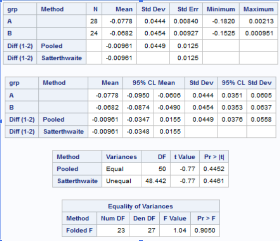
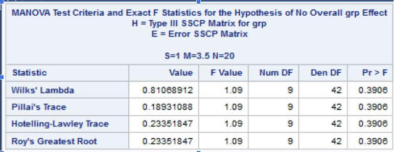
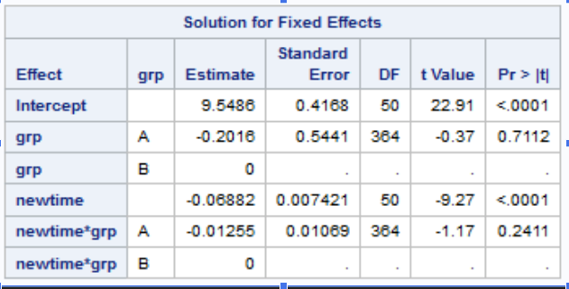
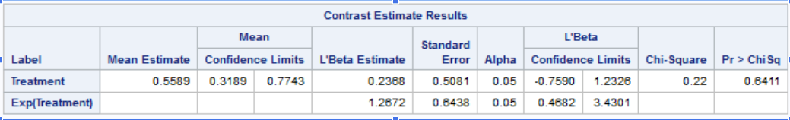

```{r setup, include=FALSE}
options(htmltools.dir.version = FALSE)
```

class: inverse, middle, center

# Background

---

IL-2 was injected into those in the Intervention Arm in addition to Antiretroviral Therapy
Control Group was just Antiretroviral Therapy

--

IL-2 increases CD4 count which should decrease the HIV viral load

--

- Is there a difference in the mean profiles of HIV viral load between the two trial arms?

- Is there a significantly different odds of not getting a detectable HIV viral load between the two trial arms?

---
# Preliminaries

```{r message=FALSE}
library(readxl)
library(haven)
library(skimr)
library(corrr);library(nlme);library(lme4)
library(geepack)
library(tidyverse)
```

```{r echo=FALSE}
hivfu_raw <- read_excel("data/Project2 HIVFU.xls") %>% as.data.frame()
il2 <- read_sas("data/il2.sas7bdat", NULL)
```

---
class: inverse, middle, center

# Exploratory data analysis

---

# Data

```{r echo=FALSE}
head(hivfu_raw, 10)
```

---

# Normality of our Outcome

RTPCRNIH was NOT a normal outcome variable

```{r echo=FALSE}
hist(hivfu_raw$rtpcrnih)
```

---

# Normality of our Outcome continued

Therefore we log-transformed it and obtained a better curve

```{r echo=FALSE}
hist(log(hivfu_raw$rtpcrnih))
```

---

# Individual viral load plot

```{r echo=FALSE}
ggplot(data = hivfu_raw, aes(x = wknumc, y = rtpcrnih, group = id)) +   
  geom_line(aes(col = id), alpha = 0.5, show.legend = F ) +
  #scale_y_continuous(limits = c(0, 120000)) +
  theme_bw() + 
  facet_wrap( ~ grp) + 
  labs(title = "Individual viral load from mth 14 to 60 before transformation between 2 grps")
```

---

# Individual viral load plot continued

```{r echo=FALSE}
ggplot(data = hivfu_raw, aes(x = wknumc, y = rtpcrnih)) + 
  geom_smooth(size = 2, col = "black", method = "loess") +
  geom_line(aes(col = id),alpha = 0.5, show.legend = F ) +
  labs(title = "Overall viral load from mth 14 to 60 before transformation", 
       subtitle = "black bold line is the loess mean profile") + 
  theme_bw()
```
---

# log transformation

```{r echo=FALSE}
ggplot(data = hivfu_raw, aes(x = wknumc, y = log(rtpcrnih), group = id)) +   
  geom_line(aes(col = id), alpha = 0.5, show.legend = F ) +
  #scale_y_continuous(limits = c(0, 120000)) +
  theme_bw() + 
  facet_wrap( ~ grp) +
  labs(title = "Individual viral load from mth 14 to 60 after transformation between 2 grps")
```

---

# log transformation continued

```{r echo=FALSE}
ggplot(data = hivfu_raw, aes(x = wknumc, y = log(rtpcrnih))) + 
  geom_smooth(size = 2, col = "black", method = "loess") +
  geom_line(aes(col = id),alpha = 0.5, show.legend = F ) +
  labs(title = "Overall viral load from mth 14 to 60 after transformation", 
       subtitle = "black bold line is the loess mean profile") + 
  theme_bw()
```

---

# Construct a groupedData Object(spread and gather)

```{r}
{{hiv_grouped <- groupedData(formula = rtpcrnih ~ wknumc | id, data = hivfu_raw[,-c(3, 5)], order.groups = F)}}
```

```{r}
hiv_spread <- hiv_grouped %>% 
  mutate(wknumc = paste0(wknumc)) %>% 
  spread(wknumc, rtpcrnih) 
```

```{r}
hiv_gather <- hiv_spread %>% 
  gather(`14`, `18`, `24`, `30`, `36`, `42`, `48`, `54`, `60`, key = wknumc, value =  rtpcrnih) %>% 
  mutate(wknumc = as.numeric(wknumc)) %>% 
  arrange(grp, id)
```

---
class: inverse, middle, center

# Visualization

---

# Counts within group

```{r}
hiv_spread %>%
  count(grp)
```
---

# Check for missingness

```{r echo=FALSE}
a <- hivfu_raw %>% count(id)
ggplot(data = a, aes(x = 1:58, y = n)) +
  geom_point() +
  labs(title = "check for missingness of repeated measures",
       x = "id", 
       y = "counts") +
  theme_bw() +
  geom_hline(yintercept = 3.1, col = "red")
```

--

The plot shows the missingness of each individual. Each id should have 9 complete viral load measurements. Here, I set the threadhold as n = 3. For individual has 3 or less recorded measurements will be excluded from the analysis.

---

# Check for missingness continued 

```{r echo=FALSE}
hiv_spread %>% filter(is.na(`30`)) %>% group_by(id)
```

--

- Here, we can see that the individuals excluded from analysis are severe cases. I think here we have sufficient reasons to assume that these individal have died or dropped out. There is no reason to impute these large numbers. 

--

- The drawback is that group B has 5 excluded and A has 1. That might cause problems in the following analysis.

---
# Summary statistics before transformation

```{r echo=FALSE}
hivfu_raw %>% group_by(wknumc) %>% 
  summarise(min = min(rtpcrnih),
            median = median(rtpcrnih),
            mean = mean(rtpcrnih),
            max = max(rtpcrnih),
            missing = 58 - n()) 
```

--

Here, the untransformed mean is much larger than median. We can tell that the distribution of viral load is right skewed. 

---

# Summary statistics after transformation

```{r echo=FALSE}
hivfu_raw %>% group_by(wknumc) %>% 
  summarise(min = min(log(rtpcrnih)),
            median = median(log(rtpcrnih)),
            mean = mean(log(rtpcrnih)),
            max = max(log(rtpcrnih)),
            missing = 58 - n()) 
```
--

The mean and median after log transformation are much closer to each other than untransformed. This indicates that a log transformation is a better option. 
---

# mean plots

```{r echo=FALSE}
mean_untrans <- hivfu_raw %>% 
  group_by(grp, wknumc) %>% 
  summarise(mean = mean(rtpcrnih), sd = sd(rtpcrnih))

mean_log <-  hivfu_raw %>% 
  group_by(grp, wknumc) %>% 
  summarise(mean = mean(log(rtpcrnih)), sd = sd(log(rtpcrnih)))

pd <- position_dodge(2) # move them 2 to the left and right

ggplot(mean_untrans, aes(x = wknumc, y = mean, col = grp)) +
    geom_errorbar(aes(ymin = mean - sd, 
                      ymax = mean + sd),
                  width = 0.2, position = pd) +
    geom_point(size = 2, position = pd) + 
    geom_line(aes(group = grp), position = pd) +
    scale_color_manual(values = c("purple", "darkorange")) +
    theme_bw() +
    labs("mean profile of viral load before log transformation")

```

---

# after log transformation

```{r echo=FALSE}
ggplot(mean_log, aes(x = wknumc, y = mean, col = grp)) +
    geom_errorbar(aes(ymin = mean - sd, 
                      ymax = mean + sd),
                  width = 0.2, position = pd) +
    geom_point(size = 2, position = pd) + 
    geom_line(aes(group = grp), position = pd) +
    scale_color_manual(values = c("red", "blue")) +
    theme_bw()  +
    labs("mean profile of viral load after log transformation")
```

---
class: inverse, middle, center

# Imputation

---

# A glance at the missing value

```{r echo=FALSE}
hiv_spread2 <- hiv_spread %>% filter(!is.na(`30`))  
# filter out cases with very few measurements
```

```{r echo=FALSE}
hiv_spread2[,-c(1:2)] %>% filter(!complete.cases(.)) %>% 
  tail(10) 
```
---

# Missingness

Our data had mostly Monotone, but had some non-Monotone missing data


FCS Multiple Imputation Predictive Mean Matching was selected


Imputed on Long Data (Time, Log Viral Load, Group)

By performing Multiple Imputation we can obtain a valid inference on MAR.
We do not have to assume MCAR, a strong assumption that may not be plausible

```{r echo=FALSE}
temp_spread <-  hiv_spread2

b <- temp_spread %>% filter(!complete.cases(.)) %>% 
  filter(`14` == 49) %>% 
  mutate(`18` = replace_na(`18`, 49))

b <- temp_spread %>% filter(!complete.cases(.)) %>%  
  filter(`18` == 49) %>% 
  mutate(`24` = replace_na(`24`, 49)) %>% 
  select(id) %>% as.matrix()

for (i in 1:52){
  if (temp_spread[i, 2] %in% b){
    temp_spread[i, 5] <- 49
  }
}

b <- temp_spread %>% filter(!complete.cases(.)) %>%  
  filter(`24` == 49) %>% 
  mutate(`30` = replace_na(`30`, 49))%>% 
  select(id)%>% as.matrix()

for (i in 1:52){
  if (temp_spread[i, 2] %in% b){
    temp_spread[i, 6] <- 49
  }
}

b <- temp_spread %>% filter(!complete.cases(.)) %>% 
  filter(`30` == 49) %>% 
  mutate(`36` = replace_na(`36`, 49))%>% 
  select(id)%>% as.matrix()

for (i in 1:52){
  if (temp_spread[i, 2] %in% b){
    temp_spread[i, 7] <- 49
  }
}

b <- temp_spread %>% filter(!complete.cases(.)) %>% 
  filter(`36` == 49) %>% 
  mutate(`42` = replace_na(`42`, 49))%>% 
  select(id)%>% as.matrix()

for (i in 1:52){
  if (temp_spread[i, 2] %in% b){
    temp_spread[i, 8] <- 49
  }
}

b <- temp_spread %>% filter(!complete.cases(.)) %>% 
  filter(`42` == 49) %>% 
  mutate(`48` = replace_na(`48`, 49))%>% 
  select(id)%>% as.matrix()

for (i in 1:52){
  if (temp_spread[i, 2] %in% b){
    temp_spread[i,9] <- 49
  }
}

b <- temp_spread %>% filter(!complete.cases(.)) %>% 
  filter(`48` == 49) %>% 
  mutate(`54` = replace_na(`54`, 49))%>% 
  select(id)%>% as.matrix()

for (i in 1:52){
  if (temp_spread[i, 2] %in% b){
    temp_spread[i, 10] <- 49
  }
}

b <- temp_spread %>% filter(!complete.cases(.)) %>%  
  filter(`54` == 49) %>% 
  mutate(`60` = replace_na(`60`, 49))%>% 
  select(id)%>% as.matrix()

for (i in 1:52){
  if (temp_spread[i, 2] %in% b){
    temp_spread[i, 11] <- 49
  }
}
```

```{r echo=FALSE}
temp_gather <- temp_spread %>% 
  gather(`14`, `18`, `24`, `30`, `36`, `42`, `48`, `54`, `60`, key = wknumc, value =  rtpcrnih) %>% 
  mutate(wknumc = as.numeric(wknumc)) %>% 
  arrange(grp, id) %>% 
  mutate(lvload = round(log(rtpcrnih),2)) # log transform 


imp_info <- mice::mice(temp_gather[,-4], m=5, maxit = 50, method = 'pmm', seed = 500, printFlag = F)
imp_gather <- mice::complete(imp_info, 1) # change number to check imputation
#write.csv(imp_gather, "data/hiv_imputed.csv")
```

```{r echo=FALSE}

```

---

# Strategy for imputation

--

- Delete patient with 3 or less repeated measurements(6 patients)

--

- I assume the NAs after 49 are still 49. (patients don't show up once their conditions get better)

--

- Log transform the viral load.

--

- Multiple impulation to the missing values.

---
class: inverse, middle, center

# Simpler Methods

--

Difference in Group Mean (t-test)

--

Difference in Group Mean Slope (OLS)

--

Difference in Group Means over Time (RM-ANOVA)


---

# Group Mean



---

# Slope



```{r}
""
```


---

class: inverse, middle, center

# repeated measures ANOVA


---

# means plot

```{r echo=FALSE}
mean_imp <- imp_gather %>% 
  group_by(grp, wknumc) %>% 
  summarise(mean = mean(lvload), sd = sd(lvload))
  
ggplot(mean_imp, aes(x = wknumc, y = mean, col = grp)) +
    geom_errorbar(aes(ymin = mean - sd, 
                     ymax = mean + sd),
                width = 0.2, position = position_dodge(2)) +
    geom_point(size = 2, position = pd) + 
    geom_line(aes(group = grp), position = pd) +
    scale_color_manual(values = c("red", "blue")) +
    theme_bw() + 
    labs("mean profiles for each group after imputation")
```

---

# Correlation martix

```{r echo=FALSE}
imp_spread <- imp_gather %>% 
  mutate(wknumc = paste0(wknumc)) %>% 
  spread(wknumc, lvload)


hiv_cor <- hiv_spread %>% 
  select(`14`:`60`) %>%
  correlate(use = "pairwise.complete.obs", diagonal = 1, quiet = T) %>% 
  #rearrange() %>%  # rearrange the correlation in order
  shave(upper = F)  # delete half of the redundant values

hiv_cor %>% fashion() # same as round()
```

---

```{r echo=FALSE}
rplot(hiv_cor) # make fancy plots
```

---

# rm ANOVA result

```{r echo=FALSE}
rmaov <- lme(lvload ~ grp + factor(wknumc) + grp * factor(wknumc), data = imp_gather, random = ~1 | id, correlation = corCompSymm(form = ~wknumc | id))
```

```{r echo=FALSE}
anova.lme(rmaov)
```

---
# Final Methods

--

MANOVA

--

Linear Mixed Effects Model

--

GEE

---

# MANOVA

---

# Output of MANOVA



---
class: inverse, middle, center

# linear mixed effect model
---

# linear mixed effect model

Determining whether or not Interaction Term is Required

LRT performed
--

 With Interaction    1863.6

--

Without Interaction  1857.5

--

With a difference of 6.1 and df = 1, Interaction term is required in the model (0.01352)

---

Determining whether or not the random slope is required

LRT performed

--

 With Slope        1863.6
 
--

 Without Slope  1863.6

--

It would seem that there is no significant difference between the models. Model with slope has better R2, but the Model without the slope has a better AIC and BIC.

---

# Output from SAS



---

# intercept only

--
lmer(formular = outcome ~ fixed effect + (random effect | id))

--

```{r echo= FALSE}
imp_gather <- imp_gather %>% 
  mutate(time = wknumc - 14)
```

Here, I recode `wknumc` - 14 as `time` so that month 14 can be the baseline and can be better interpreted through the intercept. 
--

```{r}
lme_ict <- lmer(formula = lvload ~ 1 + time + grp + (1 |id), data = imp_gather, REML = T)
```
---

# intercept only continued

```{r echo=FALSE} 
summary(lme_ict)
```

---

# intercept only continued

```{r echo=FALSE}
hiv_pred <- imp_gather %>% 
  mutate(.pred_int = predict(lme_ict)) %>% 
  mutate(resid_int  = residuals(lme_ict))
```

```{r echo=FALSE}
ggplot(data = hiv_pred, aes(x = time, y = .pred_int, col = grp)) +
  geom_line(aes(group = id), alpha = 0.7) +
  theme_bw()
```

---

# random effect of intercept and time 

```{r}
lme_time <- lmer(formula = lvload ~ 1 + time * grp + (time ||id), data = imp_gather, REML = )
```

---

# int and time continued 

```{r echo=FALSE}
summary(lme_time)
```

---

# int and time continued 

```{r echo=FALSE}
hiv_pred <- imp_gather %>% 
  mutate(.pred_3 = predict(lme_time))%>% 
  mutate(resid_3  = residuals(lme_time))
```

```{r echo=FALSE}
ggplot(data = hiv_pred, aes(x = time, y = .pred_3)) +
  geom_line(aes(group = id, col = grp), alpha = 0.5) +
  theme_bw()
```
---

# lmer comparsion

```{r}
anova(lme_ict, lme_time)
```

---

$R^2$

```{r warning=FALSE, echo=FALSE}
MuMIn::r.squaredGLMM(lme_ict)

MuMIn::r.squaredGLMM(lme_time)
```

---

# Checking model assumption

```{r echo=FALSE}
ggplot(data = hiv_pred, aes(x = resid_3)) +
  geom_density(aes(col = grp)) +
  labs(title = "Check the residuals' normality assumption")
```

---
class: inverse, middle, center

# Dichotomous outcome


---

# A look at the outcome

```{r echo=FALSE}
imp_gather <- imp_gather %>% 
  mutate(vcat = ifelse(lvload <= 3.90, 1, 0))

imp_gather %>% 
  group_by(grp) %>% 
  count(vcat) %>%  kable()
```

```{r echo=FALSE}
imp_gather %>% 
  group_by(time) %>% 
  summarise(prop = mean(vcat))
```

Here, I code viral load measurement < 49 as "1" because it's the good outcome and the result we expect.

---

# GLMM

```{r}
#e <- glmer(vcat ~  time * grp + ( | id), data = imp_gather, family = "binomial")
```

I tried to use GLMM, but the model failed to converge and has very large eigenvalue.

---
class: inverse, middle, center

# GEE
---

# Output from SAS



---

# GEE

```{r}
gee_ind <- geeglm(vcat ~  1 + time *grp, data = imp_gather, id = id, family = "binomial", scale.fix = T)

gee_ex <- geeglm(vcat ~  1 + time *grp, data = imp_gather, id = id, family = "binomial", scale.fix = T, corstr = "exchangeable")

gee_ar1 <- geeglm(vcat ~  1 + time *grp, data = imp_gather, id = id, family = "binomial", scale.fix = T, corstr = "ar1")

gee_unstr <- geeglm(vcat ~  1 + time *grp, data = imp_gather, id = id, family = "binomial", scale.fix = T, corstr = "unstr")
```

```{r}
list(gee_ind, gee_ex, gee_ar1, gee_unstr) %>% 
  map(MuMIn::QIC)
```

---

# GEE summary

```{r echo=FALSE}
summary(gee_ar1)
```

---

# Visualization

```{r echo=FALSE}
gee_pred <- imp_gather %>% 
  mutate(pred_gee = predict(gee_ar1, type = "response"))

gee_pred %>% ggplot() +
  geom_line(aes(x = time, y = pred_gee, col = grp)) + 
  theme_bw() +
  labs(title = "Prbability of getting undetected viral load between 2 grps")
```

---
class: inverse, middle, center

# Summary
---

Research Question

- Does IL-2(grp A) has an significant effect on HIV viral load("rtpcrnih") than control group(grp B) from 14 months post-randomization onwards?

--

We use repeated measures ANOVA, linear mixed effect model and GEE to find out if there is a difference in effect between 2 treatment groups. 

--

All evidence suggests that there is not a significant effect between treatments. 

--

The treatment effect is slightly better for grp A. IL-2(Grp A) does not have an significant effect in reducing HIV viral load from mth 14 to 60 than group B. 

